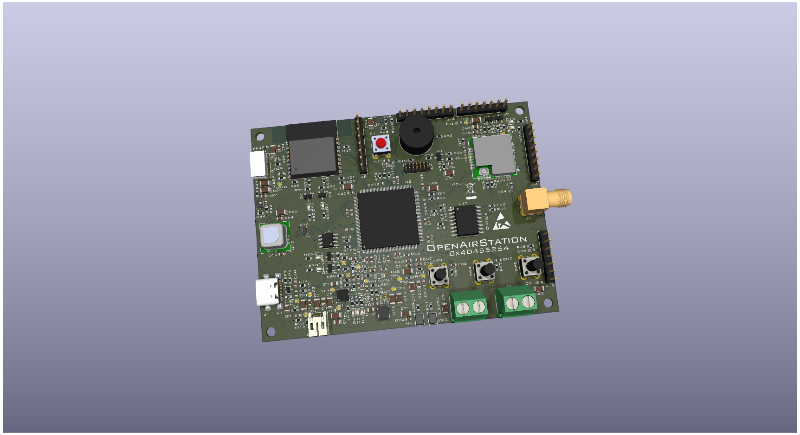
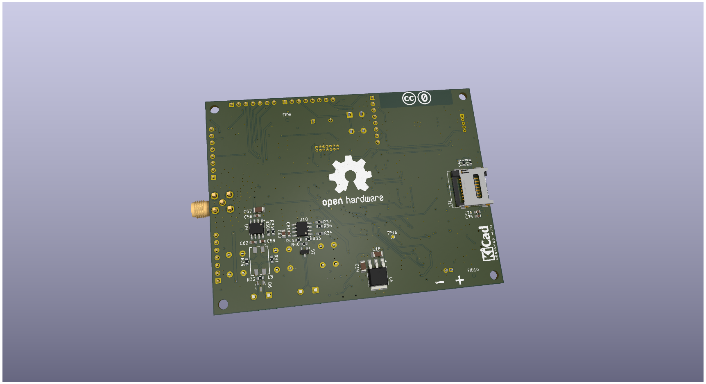
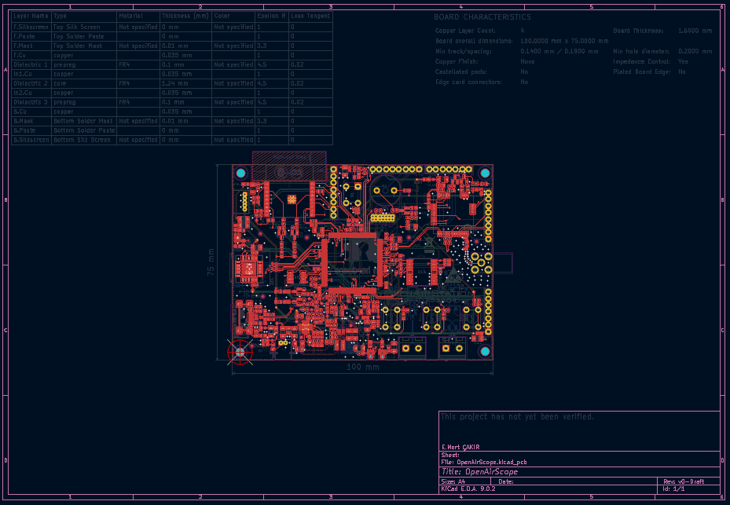

EMC
---
# OpenAirScope 🌍💨

**OpenAirScope** is an open-source hardware and software project designed for advanced environmental monitoring and air quality measurement. It is based on the STM32H743 and ESP32-C3, supports LoRaWAN, and is equipped with a wide range of up-to-date sensors and display options.

### PCB Assembly

### PCB Layout

## Features

* **High-Performance MCU**:

  * STM32H743 (ARM Cortex-M7, 400 MHz)
  * Capable of running advanced algorithms and real-time data processing
  * Multiple communication interfaces (I²C, SPI, UART, CAN, USB, RS485)

* **Wireless Communication**:

  * **ESP32-C3-WROOM-02** → Wi-Fi + Bluetooth LE
  * **RAK3172 (LoRaWAN)** → Low-power, long-range wireless communication
  * External **SMA antenna connector** (for LoRa)

* **Sensor Support (Optional/Modular)**:

  * **SGP41-D-R4** → Gas sensor (VOC and NOx measurement)
  * **SCD40-D-R2** → CO₂, temperature, and humidity sensor
  * **SPS30** → Particulate matter sensor (PM1.0, PM2.5, PM4, PM10)
  * **LTR-303ALS-01 (Optional)** → Ambient light sensor
  * **SPH0645LM4H-B (2 units)** → Digital MEMS microphone (ambient noise, sound level, acoustic analysis)
  * Expandable design: additional sensors such as pressure or UV can be integrated

* **Display**:

  * **1.5-inch RGB OLED Display Module**
  * 65K RGB colors, 128×128 resolution
  * SPI interface for fast graphics and real-time data visualization

* **Power Management**:

  * **Li-Ion battery support**
  * USB-powered with **simultaneous battery charging**
  * Suitable for both portable and stationary applications

* **Flexible Communication**:

  * USB-C interface
  * RS485 (for industrial environments)
  * CAN-Bus support
  * IoT integration via Wi-Fi and LoRaWAN

* **Modular Design**:

  * Optional sensor add/remove capability
  * External SMA antenna for long-range connectivity
  * Developer-friendly accessible pinout

* **Software**:

  * STM32CubeIDE / PlatformIO support
  * Open-source drivers and example libraries
  * Example algorithms for air quality and environmental data evaluation
  * OLED display example code for real-time visualization of sensor data

## Use Cases

* Smart city solutions
* Industrial environment monitoring
* Indoor/outdoor air quality tracking
* Noise pollution and sound analysis
* Portable IoT devices with OLED display
* Long-range LoRaWAN field applications
* Research and education projects

## Contributing

This project is open source. Contributions are welcome for new sensor support, software development, or documentation improvements. You can submit pull requests or open issues.

## License

Released under the MIT License.

---

